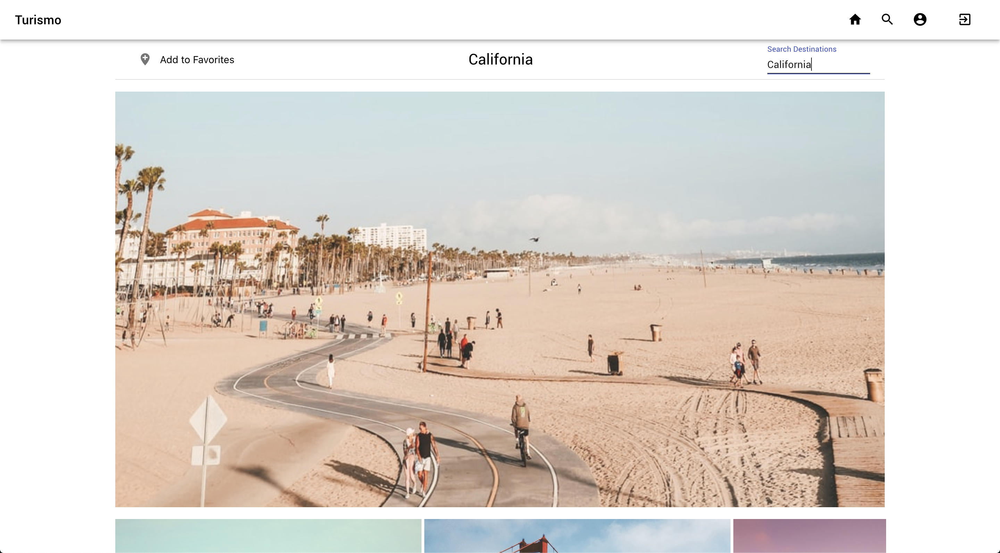

# Turismo

Turismo is a travel discovery engine providing information about landmarks, experiences, and restaurants for destinations around the globe

[Link to Backend API](https://github.com/415CA/turismo-backend)


## Table of Contents
* [Getting Started](#getting-started)
* [Features](#features)
* [Tech Stack](#tech-stack)
* [APIs](#apis)
* [Tools](#tools)


<a name="getting-started"/>

## Getting Started
1. Install [Rails Backend API](https://github.com/415CA/turismo-backend)
2. Install [Node.js and npm](https://www.npmjs.com/get-npm)

    ```$ brew install node```
    
3. Clone this repo and cd into the directory
4. Install all dependencies

    ```$ npm install```

5. Create a [Firebase](https://console.firebase.google.com/u/0/) project with your Google Account 
6. Create an .env file in the React project's root folder with the following info from your Firebase settings.
    ```
    REACT_APP_API_KEY=XXXXxxxx 
    REACT_APP_AUTH_DOMAIN=xxxxXXXX.firebaseapp.com
    REACT_APP_DATABASE_URL=https://xxxXXXX.firebaseio.com
    REACT_APP_PROJECT_ID=xxxxXXXX
    REACT_APP_STORAGE_BUCKET=xxxxXXXX.appspot.com
    REACT_APP_MESSAGING_SENDER_ID=xxxxXXXX
    REACT_APP_CONFIRMATION_EMAIL_REDIRECT=http://localhost:3000
    ```
6. Add the following API keys from the following sources to the .env file
    ```
    REACT_APP_GOOGLE_MAPS_API_KEY=XXXXX
    REACT_APP_WEATHER=XXXXX
    REACT_APP_YELP_API_KEY=XXXXX
    REACT_APP_VIA_MICHELIN=XXXXX
    REACT_APP_UNSPLASH=XXXXX
    REACT_APP_NYTIMES=XXXXX
    REACT_APP_CURRENTS=XXXXX
    REACT_APP_NEWSAPI=XXXXX
    ```
7. Make sure the Rails server is running and then run the app

    ```$ npm start```
    
<a name="features"/>

## Features

### Search Destinations


#### Explore millions of destinations and landmarks worldwide. The search can be as broad or as narrow as you would like. 

|Continent| Country | State|
|:---|:---|:---|
||||

|City| Neighborhood| Landmark|
|:---|:---|:---|
||||

### Destinations

* View travel news, Wikipedia info, photos, current weather, and a local map for your destination

### Favorite Destinations

* Save an destination via bookmark
* Remove a bookmark

### Auth & Account Features

  Log in via email and password or existing Google account, completed with [Firebase Authentication](https://firebase.google.com/docs/auth)

<a name="tech-stack"/>

## Tech Stack
* React.js
* Ruby on Rails API (Backend: https://github.com/415CA/turismo-backend)
* Firebase
* PostgreSQL
* HTML
* CSS
* Material UI
* Active Record

<a name="apis"/>

## APIs
* [Currents](https://currentsapi.services/en)
* [Google Maps](https://developers.google.com/maps/documentation)
* [NewsAPI](https://newsapi.org/)
* [NY Times](https://developer.nytimes.com/apis)
* [OpenWeatherMap](https://openweathermap.org/api)
* [Unsplash](https://unsplash.com/developers)
* [Via Michelin](https://api.viamichelin.com/services/api-js/)
* [Yelp Fusion](https://www.yelp.com/fusion)

<a name="tools"/>

## Tools
* [Axios](https://www.npmjs.com/package/react-axios)
* [ActiveModel::Serializer](https://github.com/rails-api/active_model_serializers)
* [Day.JS](https://www.npmjs.com/package/dayjs)
* [MomentJS](https://momentjs.com/)
* [Rack CORS](https://github.com/cyu/rack-cors)
* [React Router](https://reacttraining.com/react-router/web/guides/quick-start)
* [Styled Components](https://styled-components.com/)
* [Weather Icons](https://erikflowers.github.io/weather-icons/)